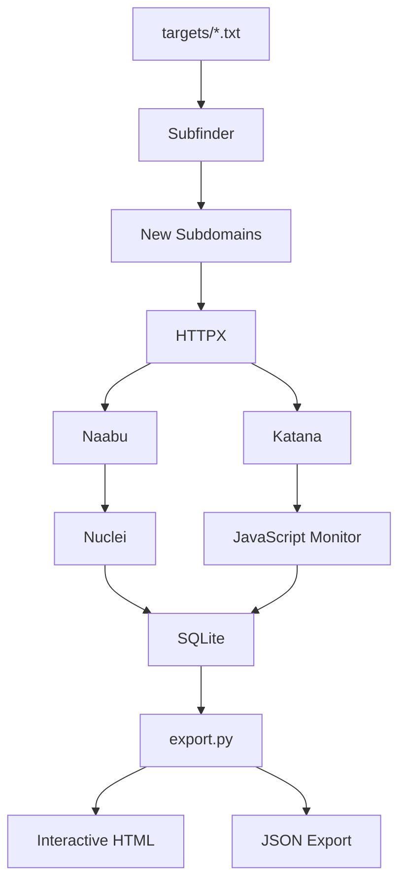

# Recon Pipeline

> A program-aware reconnaissance pipeline for authorized security testing and bug bounty programs.

## Overview

This project automates the reconnaissance lifecycle for multiple bug bounty programs while keeping all collected data isolated in a SQLite database. The main scanner (`recon.py`) discovers assets, fingerprints them, scans for vulnerabilities, performs JavaScript analysis, and stores historical results. The companion exporter (`export.py`) generates interactive HTML reports and JSON exports.

## Features

- Multi-program support (one scope file per target)
- SQLite database with schema migrations
- Subdomain discovery using Subfinder
- Live host detection with HTTPX
- Port scanning with Naabu
- Vulnerability scanning with Nuclei
- Web crawling with Katana
- JavaScript monitoring and secret detection
- ASN → CIDR → IP expansion
- Historical scan tracking
- HTML and JSON reporting
- Artifact management
- Configurable via `.env`

---

# Architecture

```text
Targets
   │
   ▼
Subfinder
   │
   ▼
SQLite Database
   │
   ├── HTTPX
   ├── Naabu
   ├── Katana
   ├── Nuclei
   ├── JS Monitor
   └── ASN Enumeration
          │
          ▼
      HTML / JSON Reports
```

## Scan Workflow



## Installation

### Requirements

- Python 3.11+
- Linux
- Go
- SQLite

### Install Python

```bash
python3 -m venv venv
source venv/bin/activate
pip install -r requirements.txt
```

### Install ProjectDiscovery Tools

```bash
go install github.com/projectdiscovery/subfinder/v2/cmd/subfinder@latest
go install github.com/projectdiscovery/httpx/cmd/httpx@latest
go install github.com/projectdiscovery/naabu/v2/cmd/naabu@latest
go install github.com/projectdiscovery/nuclei/v3/cmd/nuclei@latest
go install github.com/projectdiscovery/katana/cmd/katana@latest
go install github.com/projectdiscovery/asnmap/cmd/asnmap@latest
go install github.com/projectdiscovery/mapcidr/cmd/mapcidr@latest
go install github.com/projectdiscovery/notify/cmd/notify@latest
```

## Project Structure

```text
root/
├── recon.py
├── export.py
├── .env
├── targets/
├── logs/
├── work/
├── reports/
└── recon.db
```

## Configuration

Create a `.env` beside `recon.py`.

Important variables include:

- ROOT_DIR
- SUBFINDER_BIN
- HTTPX_BIN
- NAABU_BIN
- NUCLEI_BIN
- KATANA_BIN
- ASNMAP_BIN
- MAPCIDR_BIN
- NUCLEI_SEVERITIES
- KATANA_DEPTH
- ASN_ENABLED
- JS_MONITOR_ENABLED
- MAX_JOB_RETENTION_DAYS

## Running

Run reconnaissance:

```bash
python3 recon.py
```

Generate report:

```bash
python3 export.py --db recon.db --program company_name
```

Export all programs:

```bash
python3 export.py --db recon.db --all-programs
```

## Database

Primary tables:

- programs
- scope_domains
- subdomains
- httpx_results
- ports
- nuclei_findings
- katana_results
- js_files
- js_findings
- asn_ranges
- asn_ips
- runs
- artifacts

## Outputs

- SQLite database
- HTML dashboard
- JSON export
- Logs
- Scan artifacts
- Historical records

## Troubleshooting

- Verify ProjectDiscovery binaries are in PATH.
- Run `nuclei -update-templates`.
- Ensure the `.env` file is configured.
- Check `logs/recon_watch.log`.
- Verify write permissions for `ROOT_DIR`.

## Best Practices

- Use only on authorized targets.
- Update templates regularly.
- Schedule scans with systemd or cron.
- Back up the SQLite database.
- Periodically prune old artifacts.

## License

Use only for authorized security assessments and bug bounty programs.
